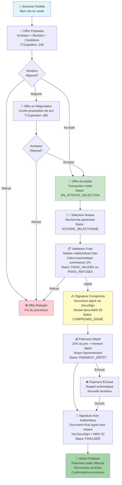

# Parcours de Vente Immo2000 - Documentation Phase 3

## Vue d'ensemble

Le parcours de vente Immo2000 est un système complet qui gère l'intégralité du processus de vente immobilière, de la création d'une offre à la signature chez le notaire et le paiement final.

## Architecture

### Modèles de Données

```
Annonce (bien à vendre)
  ↓
Offre (acheteur propose un prix)
  ↓
TransactionNotaire (après acceptation)
  ├→ FraisNotaire (validation par notaire)
  ├→ CommissionImmo2000 (2% automatique)
  └→ Paiement(s) (dépôt, solde, frais)
```

### Services d'Intégration

1. **DocuSign**: Signature électronique des documents
2. **Stripe**: Gestion des paiements (dépôt, solde, frais)
3. **SendGrid**: Notifications par email
4. **AWS S3**: Archivage des documents signés
5. **APScheduler**: Rappels automatiques

## Flux du Parcours de Vente



## Flux de Paiement

```
Prix de vente: 300 000€

Frais à payer par l'acheteur:
├─ Dépôt de garantie (15% de 300k) = 45 000€ ✓ (ASAP)
├─ Frais notaire (variable) = 8 000€ (après validation notaire)
├─ Commission Immo2000 (2% de 300k) = 6 000€ (déduite du dépôt)
└─ Solde (reste) = 255 000€ ✓ (après acte)

Total à payer: 308 000€
```

## Gestion des Statuts

### Statut Offre

```
PROPOSÉE (24h)
├─→ ACCEPTÉE (création transaction)
├─→ REFUSÉE (fin)
└─→ NÉGOCIATION (48h)
    ├─→ ACCEPTÉE
    └─→ REFUSÉE (fin)
```

### Statut Transaction

```
EN_ATTENTE_SELECTION
→ NOTAIRE_SÉLECTIONNÉ
→ EN_ATTENTE_VALIDATION (frais)
→ FRAIS_VALIDÉS
→ COMPROMIS_SIGNÉ
→ PAIEMENT_DÉPÔT
→ EN_ATTENTE_PAIEMENT_SOLDE
→ FINALISÉE
```

### Statut Paiement

```
EN_ATTENTE
├─→ RÉUSSI (via Stripe webhook)
├─→ ÉCHOUÉ (via Stripe webhook)
└─→ ANNULÉ (manuelle)
```

## Rappels Automatiques

| Tâche | Fréquence | Condition | Destinataire |
|-------|-----------|-----------|--------------|
| Offre non répondues | Toutes les heures | 24h sans réponse | Vendeur |
| Négociations bloquées | 2x/jour (9h, 17h) | 48h sans réponse | Acheteur + Vendeur |
| Paiement dépôt | 1x/jour (10h) | 3j après compromis | Acheteur |
| Documents en attente | 2x/jour (8h, 16h) | 5j sans signature | Notaire + Parties |

## Fichiers Créés

### Backend
- `backend/src/models/paiements.py` - Modèles Paiement, FraisNotaire, CommissionImmo2000
- `backend/src/routes/transactions.py` - Endpoints transactions (7 endpoints)
- `backend/src/routes/paiements.py` - Endpoints paiements (8 endpoints)
- `backend/src/services/external_integrations.py` - Services externes (DocuSign, Stripe, SendGrid, S3)
- `backend/src/services/scheduler_parcours_vente.py` - Rappels automatiques APScheduler
- `backend/tests/test_parcours_vente.py` - 13 tests unitaires

### Documentation
- `docs/API_PARCOURS_VENTE.md` - Documentation API complète (tous les endpoints)
- Ce fichier - Vue d'ensemble et architecture

## Configuration Requise

### Variables d'Environnement

```bash
# DocuSign
DOCUSIGN_CLIENT_ID=...
DOCUSIGN_PRIVATE_KEY=...
DOCUSIGN_USER_ID=...
DOCUSIGN_BASE_URL=https://demo.docusign.net/restapi
DOCUSIGN_OAUTH_URL=account-d.docusign.com

# Stripe
STRIPE_SECRET_KEY=sk_test_...
STRIPE_PUBLIC_KEY=pk_test_...
STRIPE_WEBHOOK_SECRET=whsec_...

# SendGrid
SENDGRID_API_KEY=SG.....

# AWS S3
AWS_ACCESS_KEY_ID=...
AWS_SECRET_ACCESS_KEY=...
AWS_S3_BUCKET=immo2000-documents
AWS_S3_REGION=eu-west-1
```

### Dépendances à Installer

```bash
pip install docusign-esign==3.20.0
pip install stripe==7.0.0
pip install sendgrid==6.9.7
pip install boto3==1.34.0
pip install APScheduler==3.10.4
```

## Utilisation

### Initialiser le Scheduler

Dans `backend/src/app.py`, ajouter:

```python
from src.services.scheduler_parcours_vente import init_scheduler

# Au sein de create_app()
if not app.debug:  # Seulement en production
    init_scheduler(app)
```

### Exemples d'API

#### Créer une offre
```bash
curl -X POST http://localhost:5000/api/v1/offres \
  -H "Content-Type: application/json" \
  -H "Authorization: Bearer TOKEN" \
  -d '{
    "annonce_id": 1,
    "prix_propose": 295000,
    "conditions_suspensives": "Obtention prêt",
    "message": "Offre sérieuse"
  }'
```

#### Répondre à une offre
```bash
curl -X POST http://localhost:5000/api/v1/offres/1/repondre \
  -H "Content-Type: application/json" \
  -H "Authorization: Bearer TOKEN" \
  -d '{
    "action": "accepter"
  }'
```

#### Sélectionner un notaire
```bash
curl -X POST http://localhost:5000/api/v1/transactions/1/notaire \
  -H "Content-Type: application/json" \
  -H "Authorization: Bearer TOKEN" \
  -d '{
    "notaire_id": 5
  }'
```

#### Créer un paiement
```bash
curl -X POST http://localhost:5000/api/v1/paiements \
  -H "Content-Type: application/json" \
  -H "Authorization: Bearer TOKEN" \
  -d '{
    "transaction_id": 1,
    "montant": 45000,
    "type": "depot_garantie"
  }'
```

## Tests

Exécuter les tests unitaires:

```bash
pytest backend/tests/test_parcours_vente.py -v
```

Pour avoir un rapport de couverture:

```bash
pytest backend/tests/test_parcours_vente.py --cov=src --cov-report=html
```

## Points d'Amélioration Futurs

1. **Intégration DocuSign**: Implémenter authentification JWT et gestion documents
2. **Intégration Stripe**: Connecter webhooks et confirmer paiements
3. **Intégration SendGrid**: Tester envois email en production
4. **Frontend**: Créer pages React/Jinja2 pour tout le flux
5. **Notifications**: Ajouter WebSocket pour notifications en temps réel
6. **Courtiers**: Ajouter rôle courtier dans le flux
7. **Rapports**: Dashboard pour suivi des ventes par statut
8. **Conformité**: Audit trail complet de toutes les étapes

## Troubleshooting

### Scheduler ne démarre pas
- Vérifier que APScheduler est installé
- Vérifier que `init_scheduler()` est appelée au démarrage
- Vérifier les logs pour les erreurs

### Paiement échoue
- Vérifier les clés Stripe (test vs production)
- Vérifier que webhook est configuré dans Stripe dashboard
- Vérifier les logs Stripe pour les erreurs

### Email non envoyé
- Vérifier SENDGRID_API_KEY dans .env
- Vérifier que l'email est valide
- Vérifier les logs pour les erreurs d'envoi

## Support

Pour toute question ou problème, se référer à:
- [Documentation API](docs/API_PARCOURS_VENTE.md)
- Tests unitaires: `backend/tests/test_parcours_vente.py`
- Services: `backend/src/services/external_integrations.py`

---

**Dernière mise à jour**: 19 mai 2026
**Phase**: 3 (Parcours de Vente)
**Statut**: Implémentation complète des modèles, routes et services
