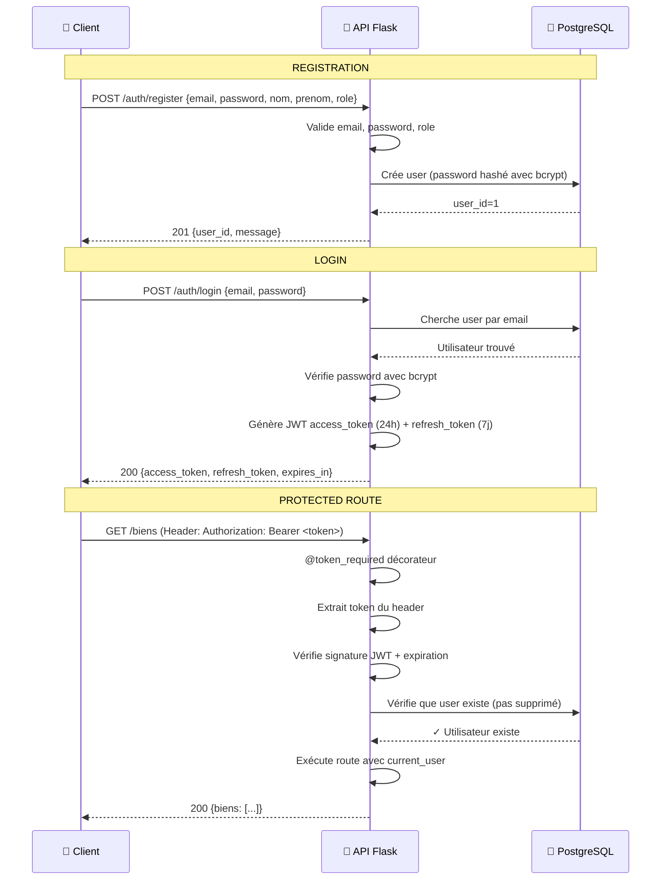
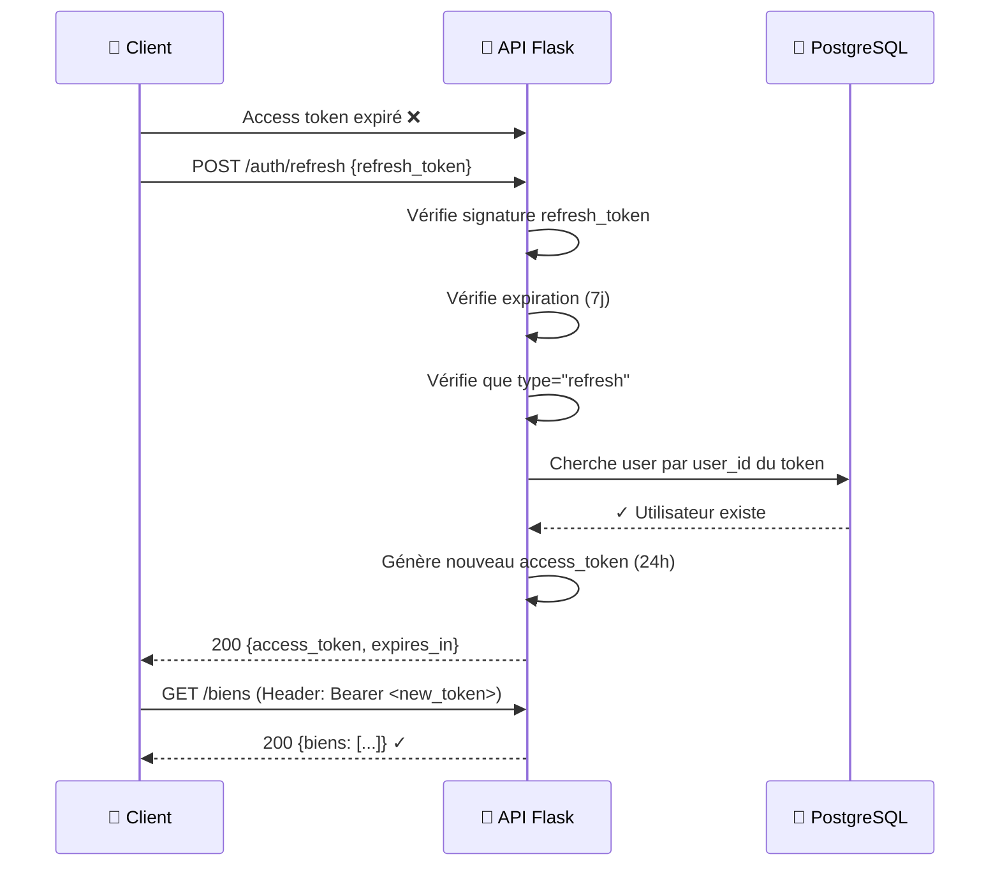
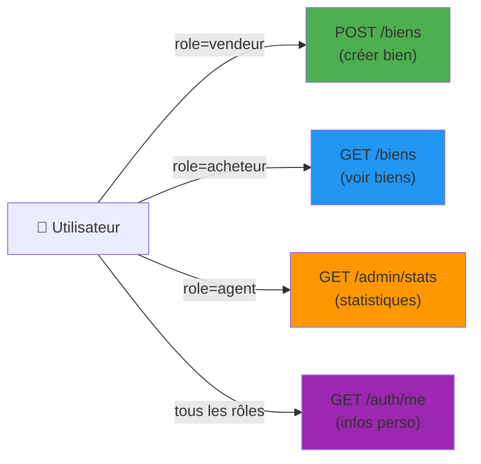
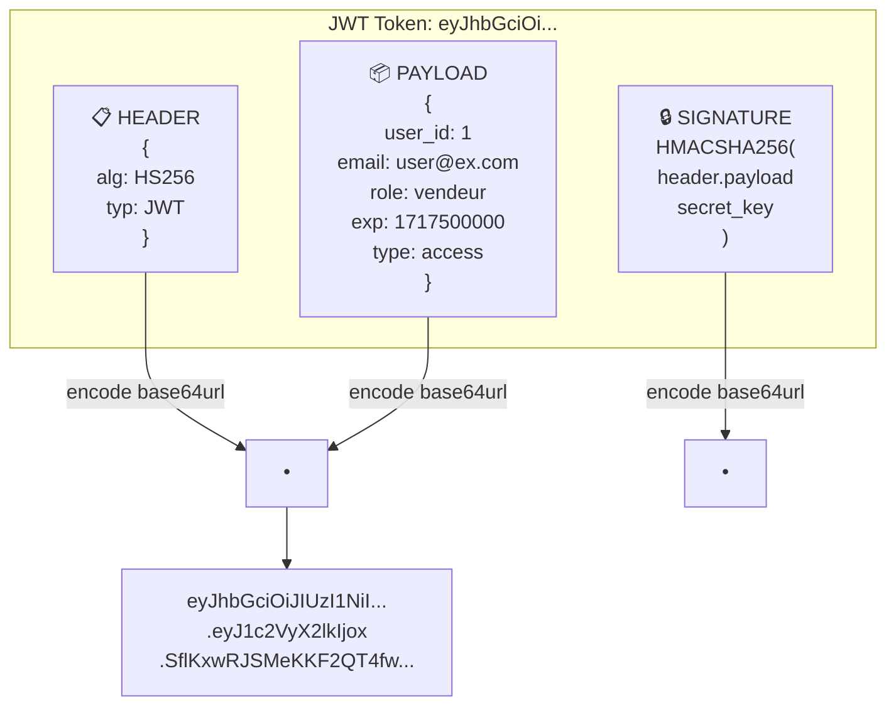
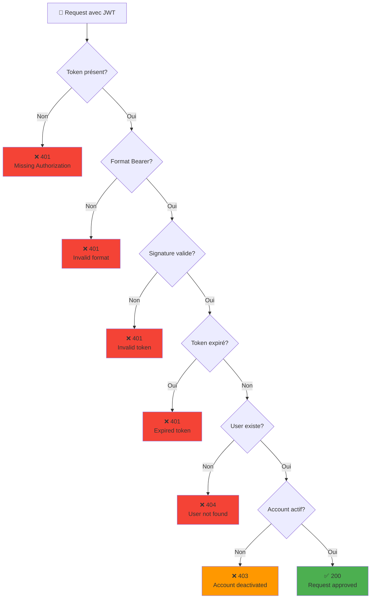
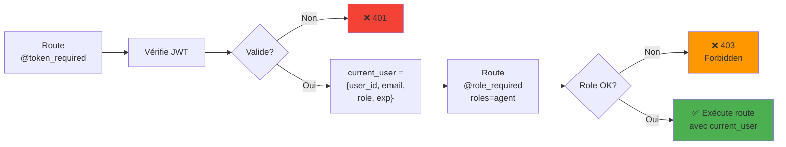
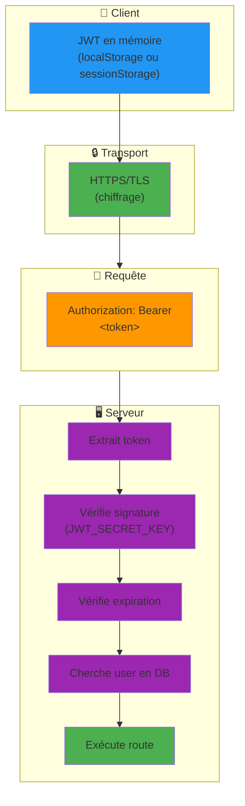
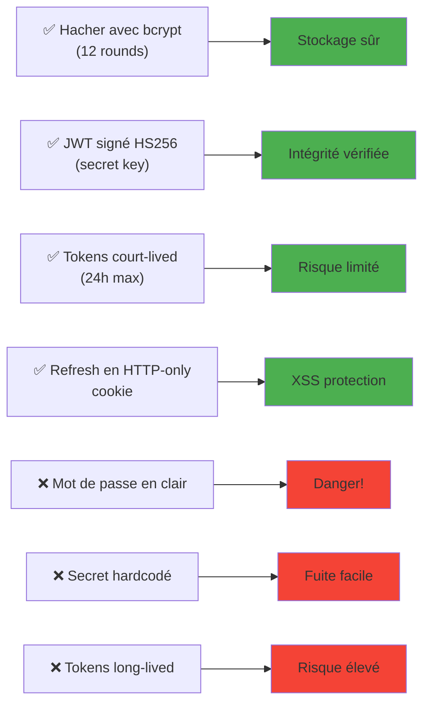

# 🔐 Diagrammes d'Authentification JWT - Immo2000

## 1️⃣ Flux d'authentification (Register → Login → Protected Route)



---

## 2️⃣ Flux de rafraîchissement de token



---

## 3️⃣ Architecture des rôles et restrictions



---

## 4️⃣ Structure du JWT



---

## 5️⃣ Flux d'erreur d'authentification



---

## 6️⃣ Cycle de vie des tokens

```mermaid
timeline
    title Cycle de vie Access Token (24h) vs Refresh Token (7j)

    Access Token:
        00:00: Généré (exp: +24h)
        12:00: Valide ✓
        23:59: Valide ✓
        24:01: Expiré ❌
            : Refresh → Nouveau token

    Refresh Token:
        00:00: Généré (exp: +7j)
        01:00: Valide ✓
        07:00: Valide ✓
        07:01: Expiré ❌
            : Reconnecter (login)
```

---

## 7️⃣ Intégration avec les décorateurs



---

## 8️⃣ Schéma de sécurité



---

## 📊 Tableau comparatif : Access vs Refresh Token

| Aspect | Access Token | Refresh Token |
|--------|--------------|---------------|
| **Durée** | 24h | 7 jours |
| **Usage** | Toutes les requêtes | Rafraîchir access token |
| **Stockage** | Memory/localStorage | Secure cookie (idéal) |
| **Risque** | Court → Perte limitée | Long → À protéger |
| **Type JWT** | `"type": "access"` | `"type": "refresh"` |
| **Endpoint** | Inclus dans chaque requête | POST /auth/refresh |

---

## 🔐 Bonnes pratiques illustrées



---

**Version** : 1.0
**Dernière mise à jour** : 2026-05-04
